```{r setup, include=FALSE}
knitr::opts_chunk$set(echo = TRUE, fig.pos = "H", out.extra = "")
library(tidyr)
library(dplyr)
library(kableExtra)
```

\newpage

```{r abbreviations, echo=F, eval=F,message=F, warning=F, fig.align="center"}
df = tribble(
    ~Abbreviation, ~ Explanation,
    "AOD", "Aerosol Optical Depth",
    "CHIRPS", "Climate Hazards Group InfraRed Precipitation with Station data"
    "P", "Precipitation"
    "CER", "Cloud Effective Radius",
    "CWP", "Cloud Water Path",
    "COT", "Cloud Optical Thickness",
    "MODIS","Moderate Resolution Imaging Spectroradiometer",
    "RH", "Relative Humidity"
) %>%
    arrange(Abbreviation)
kable(df,"latex", booktabs=T, align="l")%>%
  kable_styling(latex_options = c("HOLD_position"))
```
\newpage


# Introduction
In the last years, an increasing scientific interest has been awoken in terms of 
the interaction between aerosols and the elements of the hydrological cycle 
[@Ng2017, 1]. Precipitation patterns and their influence on human’s 
living environment can be connected with a variety of ecological, economic and 
social challenges on different spatial extents [@Boucher2013, 573 ff.]. 
Especially in semi-arid and arid regions changes in rainfall rates can affect 
health of local residents [@Issanova2015, 3213ff.]. Where water is an 
already scarce resource, further decreases will promote rising vulnerability to 
external threats (ibid.). Regarding this, the Aral Sea region can be seen as a 
first-class example for investigations between aerosols and rainfall activities 
[@Shen2019, 1]. With the desertification of the Aral Sea it has been 
subject to substantial changes in terms of water availability 
[@Groll2019, 1]. Deserts contain a high proportion of mineral aerosols, 
which may initiate climatological mechanisms of high complexity and, ultimately, 
a shift in precipitation rates [@Boucher2013, 573 ff.]. Still, it is hard 
to quantify the effects on other environmental parameters [@Ng2017, 1]. 
The relationship between aerosols and cloud microphysics as well as precipitation 
patterns remains one of the biggest uncertainties in climate studies [@Altaratz2013, 1].
Aerosols play a major role in changes of the earth’s energy budget 
[@Ng2017, 1] and can be seen as an important component of global 
climate [@Carrico2003, 1]. There exist four major terrestrial sources for 
atmospheric aerosols which, based on their chemical composition, either absorb 
or scatter incoming solar and terrestrial radiation [@Sharif2015, 657f]. 
These direct effects may cool the surface and affect evaporation 
[@Ng2017, 1]. Also, aerosols act as cloud condensation nuclei (CCN) 
leading to more and smaller droplets, which is called the first indirect aerosol 
effect [@Costantino2010, 1]. The result is a suppression of 
precipitation, while the second indirect effect prolongs the cloud’s lifetime 
through the prevention of coalescence favouring the occurrence of extreme events 
[@Ng2017, 2]. By heating the cloud, the coverage area is reduced, 
again leading to a higher amount of radiation on the ground. This attenuates 
surface evaporation and further decreases rainfall (ibid.). A number of studies 
showed the presence of a strong seasonality in regard to aerosol concentration 
in Central Asia [@Ge2016, 62ff.;@Li2018, 2ff.]. The highest 
values occur in spring while the lowest concentrations have been measured in 
winter (ibid.). However, some studies suggest the indicated perturbation of the 
hydrological cycle to be more distinct in some places than in others [@Ng2017, 2].
The goal of this study is to analyse temporal and spatial variations of aerosols 
in the Aral Sea region in relation to precipitation patterns. Following a prior 
seminar work regarding the analysis of aerosol and cloud microphysical properties, 
it continues striving for an adequate estimation of the relationship between 
hydro-climatological parameters. Therefore, the analysis consists of the 
investigation of potential trends, their strength and direction in regard to 
aerosol concentration to rainfall rates. In order to display the overall 
effects, cloud microphysical parameters will be included as well as the 
atmosphere’s relative humidity because of its critical role on rainfall 
variability [@Altaratz2013, 1f.; @Carrico2003, 2]. Some studies 
suggest high rain rates to be associated with a rising aerosol concentration 
[@Boucher2013, 4]. Otherwise, contrary results have been observed as 
well [@Ng2017, 1ff.]. In general, time and space seem to be crucial 
[@Grandey2014, 5678ff.]. The hygroscopicity of aerosols cause the 
relative humidity to be one of the most important drivers for the observed 
relationship between AOD and rainfall [@Ng2017, 2f.]. When it 
reaches a certain concentration, it can alter the results of correlation 
analyses mainly through two effects [@Altaratz2013, 1f.]. First, relative 
humidity may cause, depending on the aerosols’ chemical properties, substantial 
growth of the particles in an humid environment [@Carrico2003, 1], 
leading to coalescence of the droplets [@Ng2017, 2ff.]. This 
depicts a rather positive relation between the variables 
[@Grandey2014, 5678]. Second, wet scavenging of aerosols through rainfall 
can occur in a mostly convective environment [@Grandey2014, 5680ff.]. It 
acts as an aerosol sink and results in a negative relationship between the 
aerosol concentration and precipitation or rather relative humidity (ibid.). 
Consequently, a negative correlation may not only reflect suppressed 
precipitation [@Ng2017, 9]. Both effects demonstrate the importance 
of the atmospheres’ humidity in questions of aerosol-precipitation relationships 
and thus will be evaluated in the following study.

# Data and Methods
## Study area
The Aral Sea basin is located in the border region between Kazakhstan and Uzbekistan 
(57 – 67 °E, 42 – 49 °N) and acts as the tail-end lake of the contributing rivers 
Amu Darya and Syr Darya (Fig. \ref{fig:aoi}). The study area is part of the global dust belt 
and shows typical features of a temperate continental climate with semi-arid to 
arid conditions. The summers are short and hot with a mean of 28.2 $^\circ C$ while 
winters are long and cold with a mean of -3.6 $^\circ C$. Precipitation rates are quite 
low with a mean of about 82.1 $mm/year$ and a maximum during winter [@Gaybull2012, 287]. 
Strong winds are often to be recorded in the study area [@Issanova2015, 3213f.].
The Aral Sea once has been the fourth largest lake on earth covering a water volume 
of 1.093 $km^3$ in 1960 [@Gaybull2012, 286]. Since then, it has been gradually 
shrinking due to over-exploitation of its natural resources by water abstraction 
for irrigation agriculture as well as the impacts of climate change [@Ge2016, 2; @Shen2019, 2031].
In the year 2003, it finally split into eastern and western parts. 
The exposed lake bed consists of salt soils and loose sand dunes turning the 
former southern and western part of the lake into the Aralkum desert
[@Shen2019, 2031f.; @Shen2016, 624] which comprises of 57.500 $km^2$ [@Opp2019, 3].
The landscape is characterized by frequent salt and sand dust storms which may 
bear several threats to the ecosystem and local human’s health [@Ge2016, 4]. 
It has been stated that the spatial and temporal dust deposition variability 
is highly significant [@Opp2019, 1ff.]. 

```{r aoi, echo=FALSE, fig.align="center",fig.pos="H",fig.cap="Overview of the study domain within the ASB (Grey-scale values represent elevation, solid red lines national boundaries and dashed isolines average yearly sums of precipitation based on CHIRPS for the years 2003-2018).", out.width="70%"}
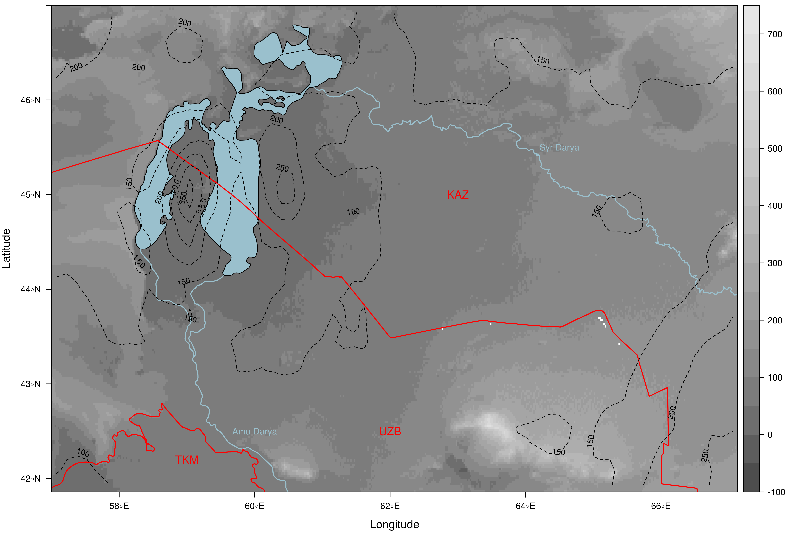
```

## Satellite products
MODIS (Moderate Resolution Imaging Spectroradiometer) data currently is collected 
by two platforms (TERRA and AQUA) orbiting the Earth on a Sun-synchronous polar 
orbit. It measures solar and thermal radiation in 36 bands in resolutions ranging 
from 250 $m$ to 1 $km$. For this study, daily resolution Level-2 data were used for 
aerosol (MOD/MYD04) [@Levy2017] and cloud (MOD/MYD06) [@Platnick2017] parameters 
as well as the corresponding geolocation files (MOD/MYD03) [@Team2012]. For 
the explanation of the parameter retrieval, the reader is referred to the prior seminar
work, as these explanations are not duplicated here, except for the newly included 
parameters of precipitation and relative humidity.

### Precipitation
_Precipitation (P):_ Monthly sums of precipitation are derived from the CHIRPS
data set. This data set is established by taking long-term monthly average data
from ground stations in conjunction with observations from five satellite missions
to establish a local regression model with a moving window for each grid cell of
0.05° in size [@Funk2015, 3f.]. The independent variables in the local regressions
consist always of the longitude and latitude information as well as one to three additional
variables representing either the local elevation, the slope or satellite observations.
Potential residuals in comparison to the FAO climate normals are interpolated
using inverse distance weighting and are than added to the local estimates [@Funk2015, 3].
In a last step, for every pixel the five nearest ground stations are used to apply
another inverse distance weighting algorithm. Here, an estimate of the decor-relation slope
from the predicted precipitation and the observed precipitation at the neighboring stations
are used to calculated a weighted average [@Funk2015, 3].

### Relative Humidity
_Relative Humidity (RH):_ RH is retrieved using the ERA-5 reanalysis data set processed by
the European Centre for Medium-Range Weather Forecasts (ECMWF) [@Forecasts2017]. 
This data set combines observations and model predictions to get a comprehensive 
model of global atmospheric conditions at small time steps and a nominal resolution
of 31km at the ground, however the data has been regridded to 0.25°. The atmosphere 
is modeled in 137 vertical levels from the surface to 1 Pa. Here, we used the 
monthly aggregates of RH only for the first seven atmospheric layers (1000 hPa - 850 hPa) 
since the other data sets were also summarized to monthly aggregates. 850 Pa was 
considered an appropriate height level, since local aerosol transports in the region
are merely reported to be found above 5 km in height [@Chen2013]. 

## Methodology
AOD and the cloud parameters were extracted from the respective MODIS data sets 
using the HEG-Tool (HDF-EOS To GeoTIFF Conversion Tool). It enables a selection of the 
cloud and aerosol properties clipping the data directly to the area of interest which 
is leaned on the shape of the study area used by [@Ge2016]. The cloud parameters
(at 6km nominal resolution) were resampled to the 10km nominal resolution of the AOD
data set. 
The observations of single MODIS overflights were then aggregated to a monthly 
temporal-resolution, and means were calculated for four different seasons 
(Spring: March, April, May (MAM); Summer: June, July, August (JJA); Autumn: September, October, 
November (SON); Winter: December, January, February (DJJ)) 
for every year between 2003 to 2018.

The CHIRPS data set already represents monthly aggregates. The cell values were resampled
to the 10km resolution of the MODIS data and seasonal aggregates were calculated as described
above. For RH, the process was basically identical, except that the median was 
calculated across the seven vertical layers, before the data was resampled to the 
same resolution as the other data sets.

To retrieve the correlation between AOD and P and to generate insights to the underlying
processes we conduct a number of correlation analysis between these two parameters,
while eliminating the influence of cloud parameters and RH. For this approach,
we firstly checked if the data fulfills the assumptions to calculate Pearson's correlation.
All variables are continuous in form. Pearson's correlation additionally is sensitive
for outliers. Similarly to other studies we thus excluded exceptional high AOD values
above 0.3. Also, we assume linear relationships between the variables for values below the 
AOD threshold of 0.3. We then calculated the correlation coefficient between AOD and P
while controlling for any other variable. This is achieved by calculating the partial correlation. 
Partial correlation is used as a measure of the linear dependence between two variables 
while controlling for the influences of a third.
In fact, not the original values of AOD and P are fitted, but rather the residuals
which were calculated by using the control variable as a predictor. Thus, only the 
proportion of variance which cannot be explained by the control variable is subject to the
correlation analysis [@Salkind2010].
This approach has been chosen by a number of recent studies investigating relationships
between aerosols and cloud microphysics as well as precipitations and seems reasonable to 
achieve both, investigating the "true" relationship between AOD and P in a complex field
of intervening processes and effects and to deliver indications for the dominant processes
driving this relationship [@Engstrom2010; @Gryspeerdt2014; @Ng2017].

The results of this analysis are presented on a pixel basis for each season to 
display spatial and temporal differences. Additionally, the correlation of all 
pixels which show a significant relationship at the 95% confidence interval 
is calculated to investigate the overall direction and strength of 
correlation between aerosol and cloud parameters [@Alam2010, 1170f.].

# Results
## Temporal and spatial variations of P and RH

The temporal and spatial variations of several aerosol and cloud parameters have been presented
in the previous seminar paper. Here, we only represent the additional parameters P
and RH.


_Temporal and spatial dynamics for P_
During the time series under study (2003 - 2018) we can observe a varying 
pattern for precipitation (Fig. \ref{fig:prec_yearly}). In 2003 we observe relatively high 
precipitation rates with an average above 200 mm per pixel and a median even 
slightly higher than the mean, which is in accordance with another study reporting
2003 as a very-wet year in Central Asia [@Xu2016]. This amount of high precipitation rates from the 
year 2003 is not reached again during the time series, instead most of the years 
indicate a mean value of precipitation below 150 mm per pixel. The years 2008, 
2011, and 2014 show exceptional low precipitation, which are note completely
in line with the findings of @Xu2016, indicating 2006, 2008 and 2011 as severe 
drought years. In 2015 and 2016 precipitation is higher than during the other years, 
however the high precipitation rate of 2003 is not reached.


```{r prec_yearly, echo=FALSE, fig.align="center", fig.show="hold", out.width="80%", fig.cap="Boxplots for yearly sum of precipitation [mm].", dpi=72}
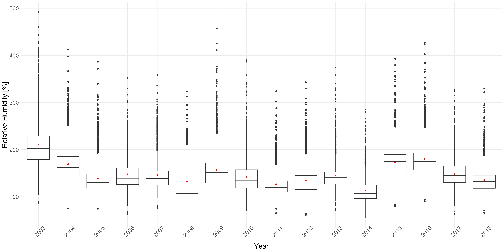
```


```{r prec_monthly, echo=FALSE, fig.align="center", fig.show="hold", out.width="60%", fig.cap="Boxplots for monthly sums of precipitation [mm].", dpi=72}
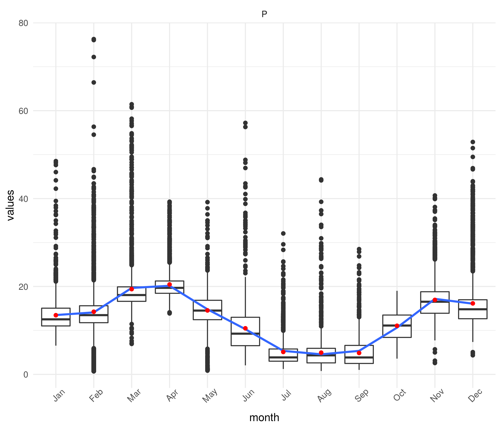
```


Concerning the intra-annual pattern of precipitation, we observe the highest 
rates in March and April as well as another peak during November and December of
about 19 mm per pixel (Fig. \ref{fig:prec_monthly}). During the summer months of 
July to September we observe the lowest precipitation rates with means about 5 mm. 
The seasonality of precipitation is thus clearly visible and is in accordance with 
the seasonal division we chose here for our analysis.

```{r p_seasonal, echo=FALSE, fig.align="center", fig.pos="H", out.width="60%", fig.cap="Spatial distribution of seasonal means for P for MAM (a), JJA (b), SON (c), and DJF (d).", dpi=72}
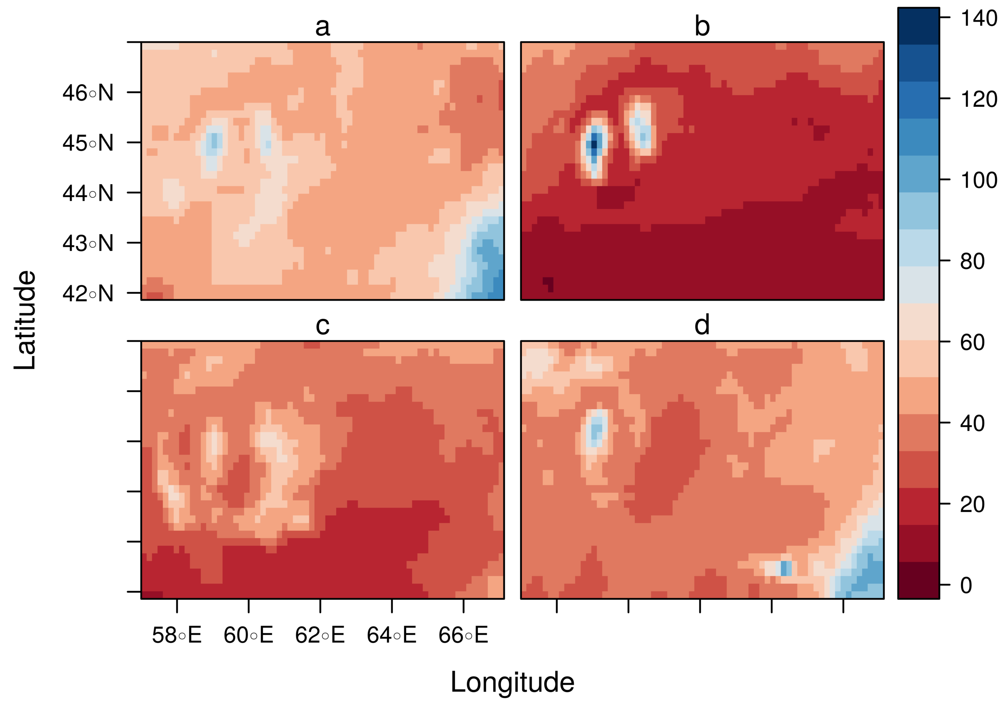
```

The spatial pattern of P shows that higher precipitation rates are found above
the Aral Sea and Aralkum dessert (Fig. \ref{fig:p_seasonal}) as well as in the 
South-East of the study area during the first and fourth season. The second and 
third season are characterized by very low precipitation rates, especially in 
the South of the study area. The linear trend analysis indicates significant 
linear trends only during the first season in the South-East of the study area. 
Here, moderate to high negative slopes seem to dominate the trend (about -2 to -5 mm/year). 
During the second season we also observe moderate to high decrease of precipitation
rate close to the Aral Sea and its Northern neighborhood. During the third and
fourth season we barley observe patterns of significant linear trends. 


_Temporal and spatial dynamics for RH_
Concerning the inter-annual dynamic of relative humidity, we observe a general 
decrease of RH per pixel during the first few years (Fig. \ref{fig:rh_yearly}). 
Similar to P, the highest level of RH is reached in 2003 with a mean value of 
50%. In 2010 and 2014, we observe RH values below 40%, and in 2012 and 2018 RH 
reaches only about 42%. With the exception of 2014, we do not see the gravity of 
the drought years of 2008 and 2011 in the dynamic of RH. During most other years 
RH usually reaches between 43 - 46%, however, in 2015 and 2016 the mean is about 
48%, in the same years we also observed relatively high precipitation rates.

```{r rh_yearly, echo=FALSE, fig.align="center", fig.show="hold", out.width="80%", fig.cap="Boxplots for yearly median of relative humididty [\\%].", dpi=72}
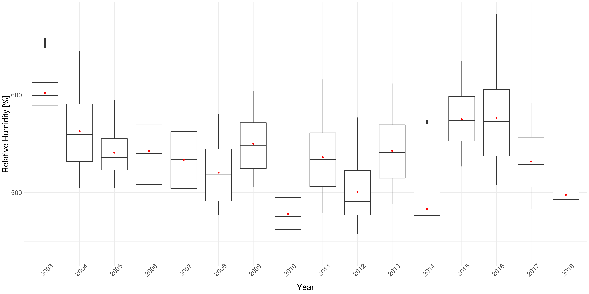
```

```{r rh_monthly, echo=FALSE, fig.align="center", fig.show="hold", out.width="60%", fig.cap="Boxplots for monthly median relative humidity [\\%].", dpi=72}
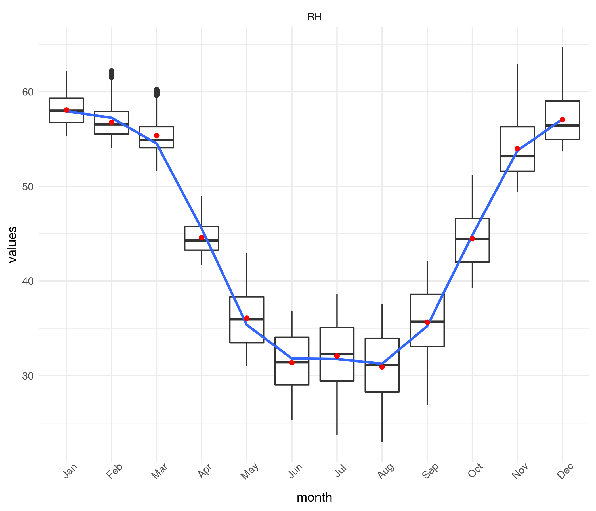
```


The intra-annual dynamic of RH follows a very clear seasonal pattern with the 
lowest RH (~31%) found in the warm summer months June to August 
(Fig. \ref{fig:rh_monthly}). RH is maximized during December to March, with levels 
between 55 - 58%. The spatial pattern of RH shows higher values through the 
study area for the first and fourth season (Fig. \ref{fig:rh_seasonal}). For 
the second and fourth season, the pattern is very similar with the lowest RH 
found in the South-East and a positive gradient towards the North-West of the 
study area. However, the values during the second season are substantially lower 
than compared to the third. Significant linear trends are only found during the 
second season South of the Aral Sea. Here, low negative slopes dominate the trend 
(about -0.3%/year).

```{r rh_seasonal, echo=FALSE, fig.align="center", fig.pos="H", out.width="60%", fig.cap="Spatial distribution of seasonal means for RH for MAM (a), JJA (b), SON (c), and DJF (d).", dpi=72}
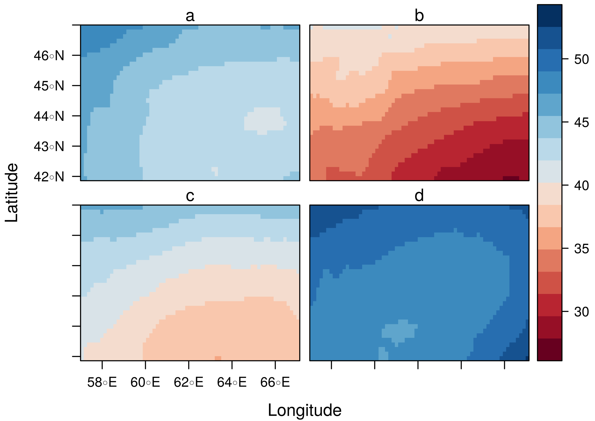
```

## Correlation analysis between AOD and P
As indicated in the methods section, we analysed the partial correlation between
AOD and P controlling for three parameters of cloud microphysics and RH. As a 
baseline we also calculated the correlation without any controlling variable. We 
excluded all pixels for which there were no observations in AOD at any time step
in order to capture the complete time series of the remaining pixels. This areas
are indicated in grey color in the figures below. 


```{r cor_aod_p, echo=FALSE, fig.align="center", fig.pos="H", out.width="65%", fig.cap="Spatial distribution of correlation coefficient rho between AOD and P for MAM (a), JJA (b), SON (c), and DJF (d).", dpi=72}
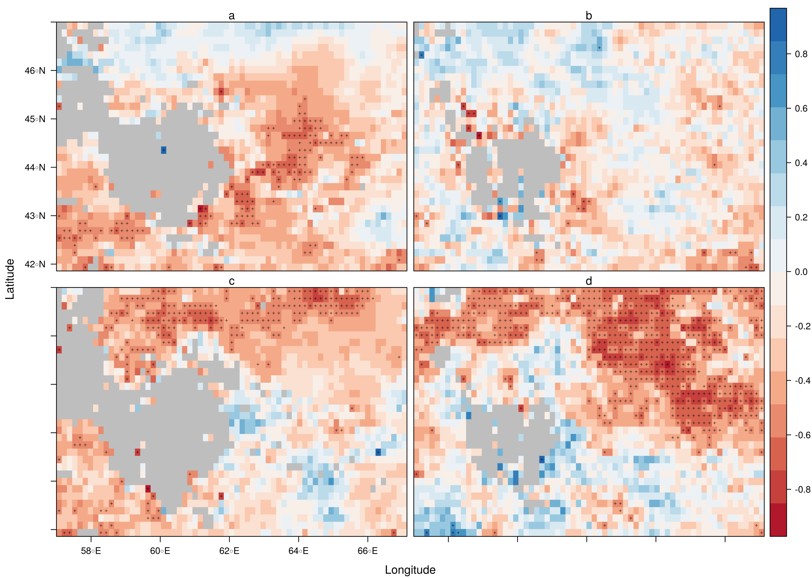
```

_Baseline correlation_: Areas with missing values are concentrated around the Aral 
Sea for all seasons (Fig. \ref{fig:cor_aod_p}). During the first and third season, 
the number of missing observations is higher than during the other seasons. For 
the first season, we observe a pattern of strongly negative correlation in the 
center of the study area and South of the Aral Sea. We also observe some, though 
non-significant, positive correlations in the North and the far South-East of the 
study area. During the second season, there are only very few locations with 
significant correlations. In general, the picture is very patchy with positive 
and negative correlations distributed fairly random in the study area, especially 
next to the Aral Sea. In the third season we observe a comprehensive patch of 
negative correlations in the North of the study area and positive correlations 
in the South. However, the positive correlations are not significant. A similar 
pattern, though larger in size extending to the South is observed during the 
fourth season. These correlations are significant and negative and generally 
between -0.4 and -0.7.

```{r cor_aod_p_cer, echo=FALSE, fig.align="center", fig.pos="H", out.width="65%", fig.cap="Spatial distribution of correlation coefficient rho between AOD and P controlled for CER for MAM (a), JJA (b), SON (c), and DJF (d).", dpi=72}
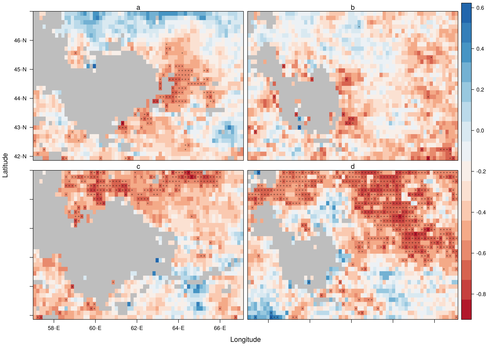
```

_Partial Correlation controlling for CER_

Concerning the spatial distribution of the correlations, the pattern is very 
similar to the baseline correlation analysis (Fig. \ref{fig:cor_aod_p_cer}). 
However, we observe slight increases in the amplitude of the significant negative
correlations for the seasons (between -0.6 and -0.85).

```{r cor_aod_p_cot, echo=FALSE, fig.align="center", fig.pos="H", out.width="65%", fig.cap="Spatial distribution of correlation coefficient rho between AOD and P controlled for COT for MAM (a), JJA (b), SON (c), and DJF (d).", dpi=72}
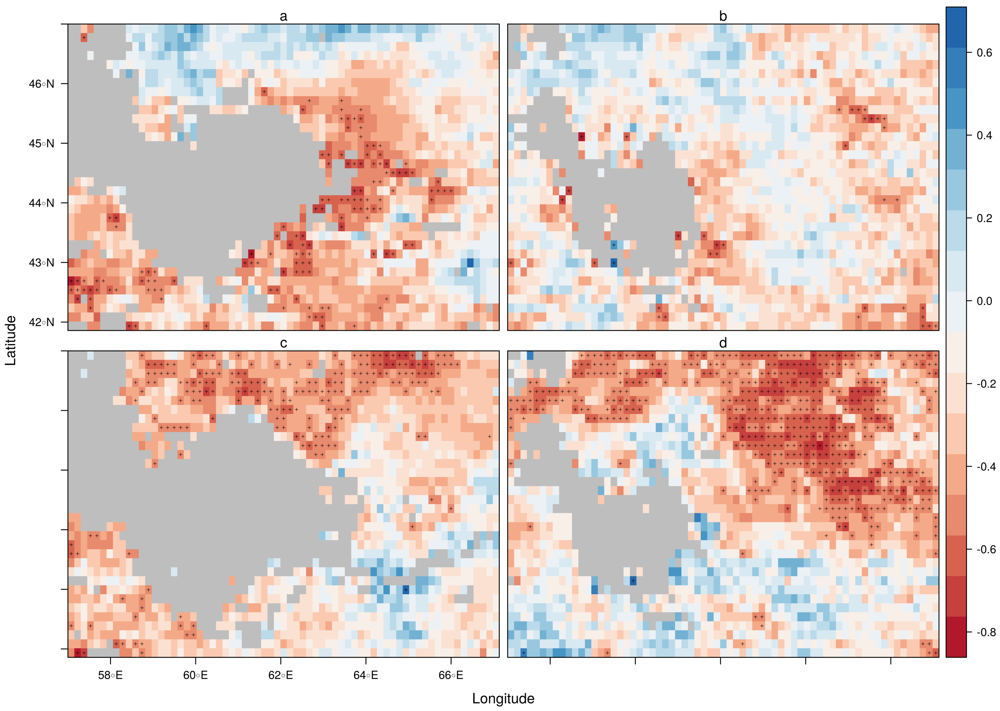
```

_Partial Correlation controlling for COT_: The amplitude and spatial 
distribution is very similar to the preceding correlation
analysis (Fig. \ref{fig:cor_aod_p_cot}). However, for the third and fourth 
season the total number of significant
correlations decreases and the comprehensive areas of negative correlations
are observed to become more patchy.

```{r cor_aod_p_cwp, echo=FALSE, fig.align="center", fig.pos="H", out.width="65%", fig.cap="Spatial distribution of correlation coefficient rho between AOD and P controlled for CWP for MAM (a), JJA (b), SON (c), and DJF (d).", dpi=72}
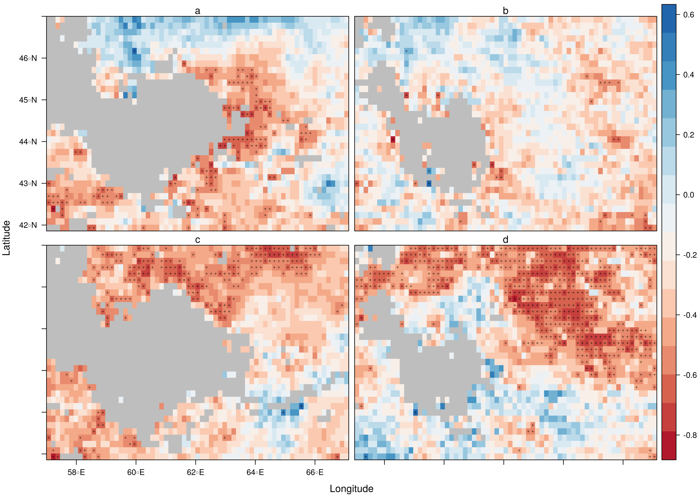
```

_Partial Correlation controlling for CWP_

For CWP again, the main patterns compared to the other analysis do not change 
(Fig. \ref{fig:cor_aod_p_cwp}). However, there seems to be a slight increase in 
the negative correlations during the fourth season.

```{r cor_aod_rh, echo=FALSE, fig.align="center", fig.pos="H", out.width="65%", fig.cap="Spatial distribution of correlation coefficient rho between AOD and P controlled for RH for MAM (a), JJA (b), SON (c), and DJF (d).", dpi=72}
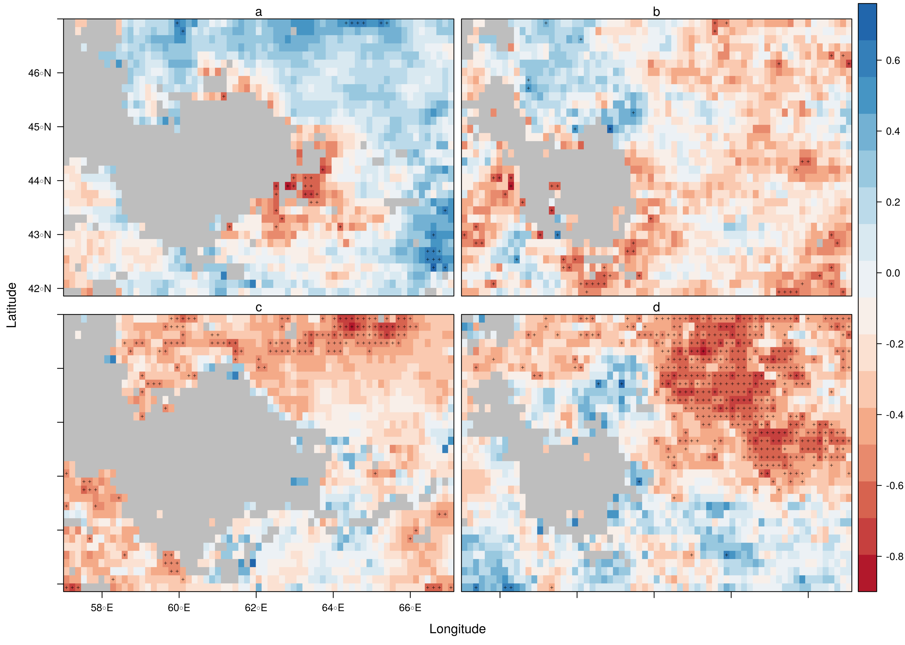
```

_Partial Correlation controlling for RH_: When controlling for RH, some changes 
can be observed (Fig. \ref{fig:cor_aod_rh}). In the first season,
the size of the patch of significant negative correlations around the Aral Sea
and Aralkum dessert is substantially reduced. The same finding holds true for
the Norther patch of negative correlations in the third season. In the fourth 
season, directly North of the Aral Sea, we observe fewer significant negative 
correlations, however, the comprehensive patch in the Center of the study area
can still be observed. In general, when controlling for RH, there seems to be 
a shift into the direction of positive correlations, because the positive correlations
increase in amplitude without reaching the level of significance.


```{r cor_aod_all, echo=FALSE, fig.align="center", fig.pos="H", out.width="65%", fig.cap="Spatial distribution of correlation coefficient rho between AOD and P controlled for all other variables for MAM (a), JJA (b), SON (c), and DJF (d).", dpi=72}
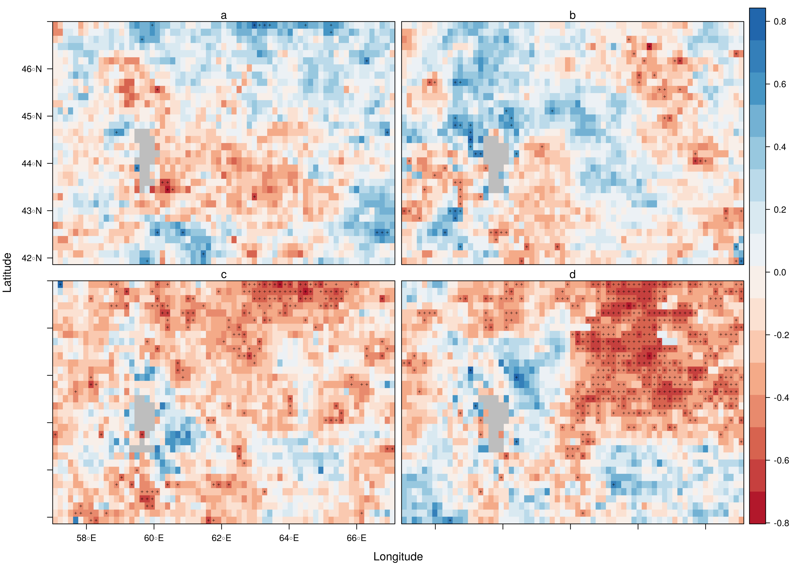
```

_Partial Correlation controlling for CWP, COT, CWP, and RH_: When controlling for 
all variables, the correlations patterns get more patchy for every season, 
which means that in large proportions of the study area we observe non-significant
positive and negative correlations in fairly random patterns next to each other (Fig. \ref{fig:cor_aod_all}).
The exceptions are a comprehensive patch of negative correlations in the North 
of the study area in the third season, though its size is substantially reduced
compared to the baseline analysis, as well as the comprehensive patch
of negative correlations in the Center of the study area during the fourth season.
Compared to the analysis controlling for RH only, the non-significant positive
correlations also seem to decrease in amplitude.

_Analysis of significant correlations_: Figure \ref{fig:total_corr} shows the 
correlations of selected pixels which showed significant correlations
for all four seasons and based on the controlling scenario. For all seasons and 
analysis we observe negative correlations between AOD and P between -0.1 and -0.38.
The correlation values for the second season are substantially closer to 0 than 
compared to all other seasons which can be easily explained by the very small number
of pixels which showed significant correlations during this seasons and the general
very low precipitation rates during this season.
For the first and third season, controlling for parameters of cloud microphysics
seem to increase the negative correlations compared to the baseline analysis while
controlling for RH delivers smaller correlations values. This observations does not hold
for the fourth season, where controlling for RH increases the correlation 
coefficient, while controlling for cloud microphysics shows little to no effects.
When all variables are controlled for, we observe no effects on the correlation 
coefficient for the first and fourth season. In the third season, controlling
for all variables decreases the coefficient from -0.38 to -0.28.

```{r total_corr, echo=FALSE, fig.align="center", fig.pos="H", out.width="65%", fig.cap="Correlation coefficients for all pixels with significant correlations by season.", dpi = 72}
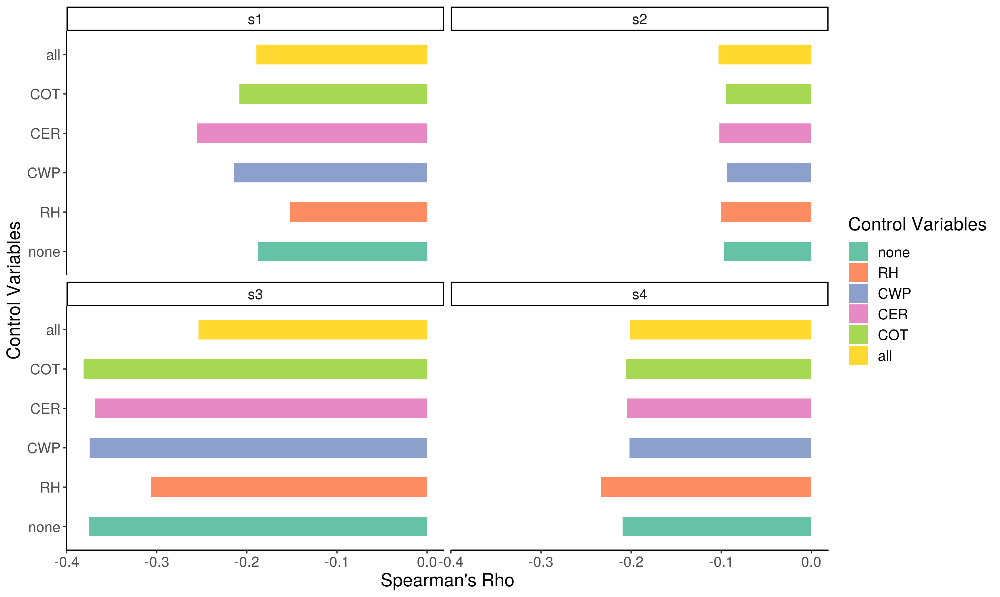
```


# Discussion

The results show the absence of a linear trend for the precipitation rates and 
the relative humidity. Otherwise, a distinct seasonal pattern which is coinciding 
between both parameters can be assumed. High moisture is accompanied by 
precipitation maxima in spring and winter, especially north of the study area 
and around the Aral Sea. This depicts a high spatial variability with a 
confirmation of the assumptions made before concerning the hydrological cycle 
for Central Asia [@Li2018, 2f.]. 

Beyond that, the relationship between AOD and precipitation controlled for cloud 
microphysical parameters as well as the relative humidity were analysed. 
Depending on the seasons, the correlation analyses imply the existence of 
diverging effects. Over all seasons, primary negative correlations turn out to 
be significant with a medium to high strength. In general, this contradicts the 
hypotheses of hygroscopic growth in the region which would lead to a strong 
positive relationship [@Ng2017, 10ff.]. Instead, other effects seem to dominate the 
existing relationship. In spring, low AOD values correlate with high precipitation rates. 
When using the cloud microphysics as a control variable, this pattern is not 
changed. Contrary, building the partial correlation with RH 
inverts the direction of the correlation. This corresponds with other studies’ 
findings about a wet scavenging effect in Central Asia during wet seasons [@Grandey2014, 5682f.]. 

In summer, the very low precipitation rates (<5mm) prevent the formation of 
distinct effects between aerosols and rainfall rates. As a result, only scattered 
patches of correlations occur. In autumn, the dry conditions attenuate the 
precipitation rates in September, thus influencing possible the outcome of the 
correlation analysis. In the north of the study area, negative correlations appear. 
The partial correlation analysis reveals that here RH is not the primary driver. 
Also, a direct influence of the depicted cloud microphysics cannot be assumed. 
Instead, the effects may originate from unknown effects, like meteorological 
parameters or satellite retrieval biases [@Ng2017, 11.]. 

In winter, a similarly strong patch of negative correlations is visible in the 
northern parts of the study area, which prevails when controlling for other 
parameters. This finding implies, that it is not the impact of one of the 
investigated parameters primary dominating the correlation analysis. Only a 
small portion around the northern edge of the Aral Sea pictures RH to be a 
primary driver, because we observe the change from negative to positive correlations. 
The analysis indicates a highly temporal variety of effects between the seasons 
as well as spatial diverse formations within the study area. 
Depending on spatio-temporal conditions the relationship between aerosol 
concentration and precipitation patterns is driven by different parameters. 
In months with a high moisture, relating effects arise [@Altaratz2013, 4f.]. 
Wet scavenging as described by @Grandey2014 may play a major role in parts of 
the study area and can form an aerosol sink, leading to positive correlations 
when it is accounted for RH. In contrast, the characteristics of the aerosols 
may suppress hygroscopic growth, leading to negative correlations. 

In regards to the aerosol type, these effects could be attributed to the 
dominance of mineral aerosols, but an comprehensive analysis is not feasible 
with the data at hand [@Altaratz2013, 4f.]. Dry conditions during some seasons 
promote ambiguous effects which cannot be traced back to the investigated 
parameters alone. However, RH seems to be one of the main drivers of the 
aerosol-rainfall relationship. Accounting for RH, reveals rather positive 
correlations between AOD and precipitation in wet conditions during spring, 
while the contrary is observed during winter. Thus, the relationship between 
aerosol and precipitation data imply a rainfall suppression in some locations 
during some seasons, but these findings are not adequately pictured in the 
correlation to cloud properties (the reader is referred to our previous seminar work). 
It remains unknown whether indirect aerosol effects like the suppression of precipitation 
in context to the Twomey- or Albrecht-effect occur in the study area. 
As a result, the study’s hypotheses can be neither confirmed not denied. 
Instead, a more detailed analysis would provide deeper insights into ongoing 
processes not just for the aerosol-cloud interactions but also for the relationship 
to the precipitation patterns [@Ng2017, 11f.]. First, the choice of seasons is not 
ideal for the study area due to a big inter-annual variance in moisture. 
Regardless of the division, months with relatively high and low values may be 
sampled within the same seasons. Second, an additional source of error may be 
the existence of a large-scale meteorological variability [@Altaratz2013, 4f.]. 
Especially in data sparse regions, a higher resolution for observing meteorological 
parameters, such as precipitation, could enhance the knowledge of the ongoing processes. 
In the context of satellite retrieval bias, failed data acquisition or 
data inhomogeneity, further evaluation is necessary in semi-arid and arid regions [@Grandey2014, 5683]. 
Nonetheless, first results for the hydrological cycle can be derived. 
Wet-scavenging as well as interactions of aerosols with cloud microphysics can 
lead to changes in the relationship between aerosols and precipitation. 
However, the effects vary in time and space, leading to either precipitation 
enhancement or suppression. Tracking of the aerosols’ origin in addition to an 
analysis of the vertical structure and aerosol type can ensure more reliable results [@Sharif2015, 660ff.].

# Conclusion

The subsequent analysis of hydrological connectivity to the aerosol characteristics 
enhances the demand for further investigations in this field of interest. An 
adequate quantification of ongoing processes is even more complex than it was 
thought to be, resulting from technological issues as well as natural mechanisms 
which tend to overlay each other and promote distortion of each other’s effects. 
Thus, answering the question of the strength and direction of relationship between 
aerosol and precipitation properties is aggravated. The study implies the existence 
of moisture related processes like wet scavenging but also the suppression of 
drizzle due to aerosol-cloud interactions. Therefore, only a temporal and spatial 
approximation of effects in the Aral Sea region can be gathered from the data. 
Further research in this highly vulnerable environment is crucial for assessing 
the situation with reliable insights. 

# References

<div id="refs"></div>
